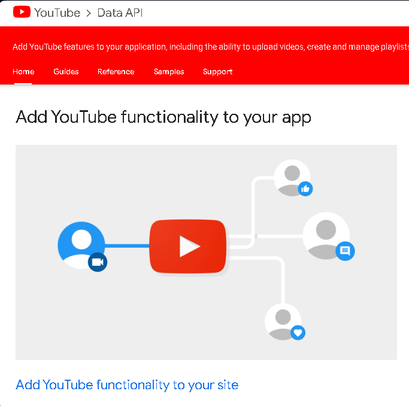

# YouTube-Data-Analysis 
python

# [Project 2: YouTube-Data-Analysis](https://akedataanalyst.github.io/YouTube-Data-Analysis/)

This is a project I did to Extract and Analyze youtube channel data with content of real estate that I watch most of the time. these project begin by accesing of youtube api and extract the data from youtube then load the data into pandas data frame. Finally Analyse and do visualization using the seaborn python library.

## PART -1 Generating YouTube API key
- Browse Google Developer conSole
- Sign in with your own google account
- Create Project
- Give it your name
- Enable APIS AND SERVICES
- or select Library
- Youtube data API v3
- Enabled the API
- Credentials
- Create Credentials
- API keys( we use these key in order to access youtube data)
Documentation for how to use access data
- Brouse Youtube data api

## PART -2 Pre-requisite
- Create virtual enivronment
- install packages(google-api-python-client, pandas, seaborn and jupyter notebook)

## PART -3 Building the project
- start my project on Jupyter notebook

`from googleapiclient.discovery import build
import pandas as pd
import seaborn as sns
import matplotlib.pyplot as plt`

[Python file](akeapi.py)
